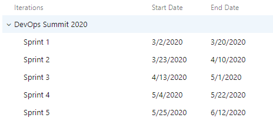

# Configuration of Azure Boards demo content

## Teams

- Navigate to the project settings cog
- Navigate to General\Teams
- Rename the default team to "Content Team"
- Create a new team called "Accounts Team"

## Paths and Iterations

### Paths

- Navigate to Boards\Project configuration
- Navigate to Areas
- Create a new Area for the content team
- Navigate to Boards\Team configuration
- Enable Epics in "Backlog navigation levels"
- select Content Team (from the very top breadcrumb)
- Change Content Team to use Content Team Area
- Remove the DevOps Summit 2020 Area

### Iterations

- Navigate to Boards\Project configuration
- Create Sprints [1-5]
- Navigate to Boards\Team configuration
- Select Accounts Team
- Select Iterations
- Add all iterations
- Do the same for the Content Team

## Extensions

- From the marketplace
  - [Delivery Plans](https://marketplace.visualstudio.com/items?itemName=ms.vss-plans&targetId=02800c77-a704-4197-99c2-b6f53a0d2ed0)
  - [Retrospectives](https://marketplace.visualstudio.com/items?itemName=ms-devlabs.team-retrospectives&targetId=02800c77-a704-4197-99c2-b6f53a0d2ed0)